# tokokita

Nama : Hendra Latieful Maajid

NIM : H1D022018

Shift KRS: D

Shift Baru: F

Tugas pertemuan 4 dan 5 (Tugas pertemuan 5 ada dibawah tugas pertemuan 4)
## Screenshot TUGAS PERTEMUAN 4
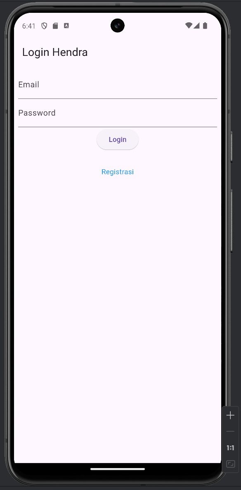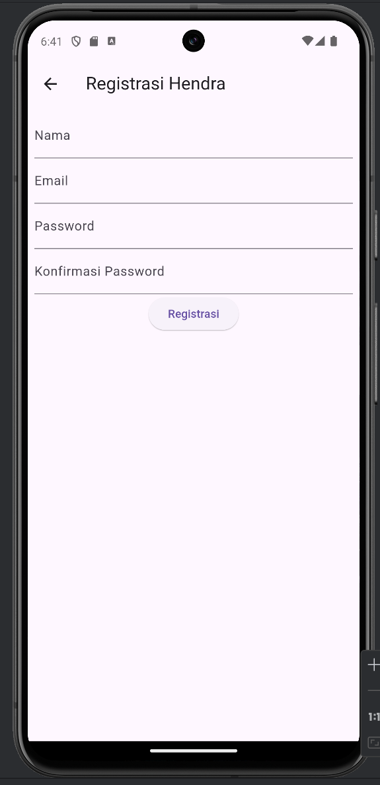
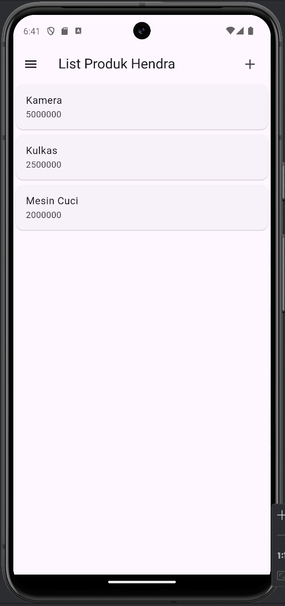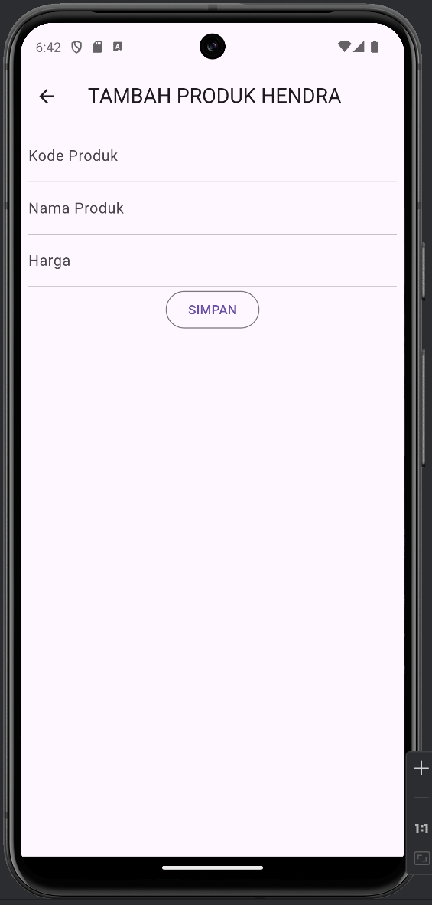
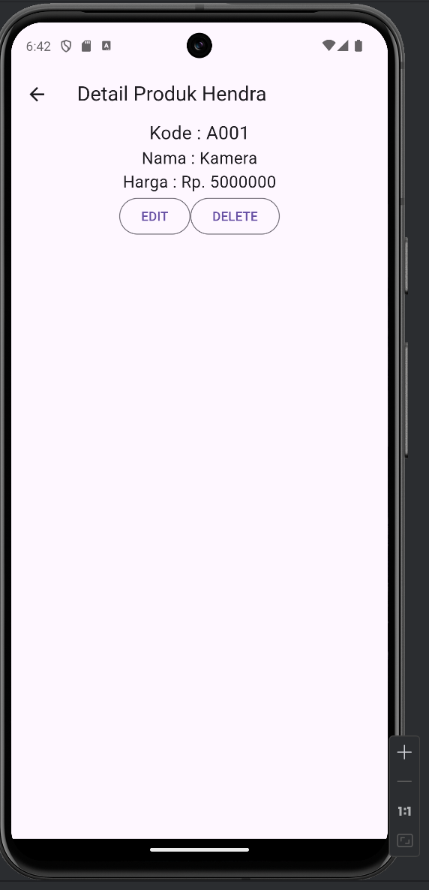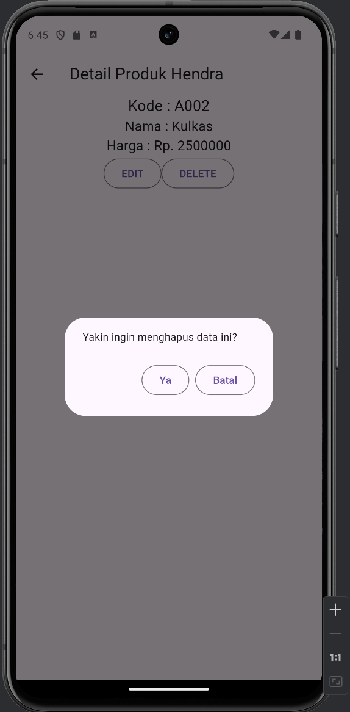
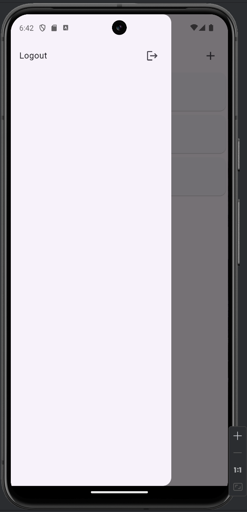


# TUGAS PERTEMUAN 5

Terdapat folder yang namanya helpers yang dimana folder ini berisi kelas-kelas dan fungsi-fungsi utilitas yang digunakan di seluruh proyek Flutter untuk membantu tugas-tugas umum seperti komunikasi API, penanganan pengecualian, dan manajemen informasi pengguna.

## Isi

1. [Api.dart](#apidart)
2. [ApiUrl.dart](#apiurldart)
3. [app_exception.dart](#app_exceptiondart)
4. [user_info.dart](#user_infodart)

### Api.dart

File ini berisi kelas `Api` yang menyediakan metode-metode untuk melakukan permintaan HTTP ke API backend. Termasuk:

- Metode POST, GET, PUT, dan DELETE
- Penyertaan token otomatis dalam header permintaan
- Penanganan kesalahan untuk masalah jaringan
- Penguraian respons dan pemetaan kesalahan

### ApiUrl.dart

Kelas `ApiUrl` dalam file ini mendefinisikan konstanta dan metode untuk membangun URL endpoint API. Termasuk:

- Konfigurasi URL dasar
- Definisi endpoint untuk berbagai rute API (registrasi, login, operasi produk)
- Metode untuk menghasilkan URL dengan parameter dinamis (misalnya, ID produk)

### app_exception.dart

File ini mendefinisikan kelas-kelas pengecualian kustom untuk menangani berbagai jenis kesalahan yang mungkin terjadi selama komunikasi API:

- `AppException`: Kelas pengecualian dasar
- `FetchDataException`: Untuk kesalahan komunikasi umum
- `BadRequestException`: Untuk permintaan yang tidak valid (kode status 400)
- `UnauthorisedException`: Untuk kesalahan autentikasi/otorisasi (kode status 401/403)
- `UnprocessableEntityException`: Untuk kesalahan validasi (kode status 422)
- `InvalidInputException`: Untuk data input yang tidak valid

### user_info.dart

Kelas `UserInfo` dalam file ini menyediakan metode untuk mengelola informasi terkait pengguna menggunakan SharedPreferences:

- Mengatur dan mendapatkan token autentikasi pengguna
- Mengatur dan mendapatkan ID pengguna
- Keluar (menghapus data tersimpan)

# A. Penjelasan Proses Registrasi 

## 1. Proses Submit
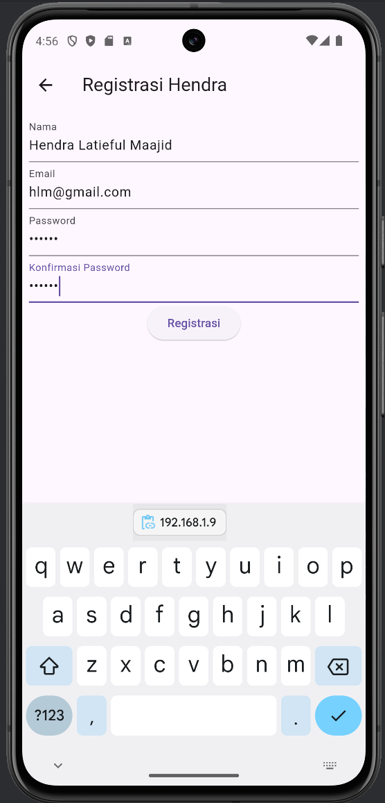

Ketika tombol "Registrasi" ditekan, method `_submit()` dipanggil:

```dart
void _submit() {
  _formKey.currentState!.save();
  setState(() {
    _isLoading = true;
  });
  RegistrasiBloc.registrasi(
    nama: _namaTextboxController.text,
    email: _emailTextboxController.text,
    password: _passwordTextboxController.text
  ).then((value) {
    showDialog(
      context: context,
      barrierDismissible: false,
      builder: (BuildContext context) => SuccessDialog(
        description: "Registrasi berhasil, silahkan login",
        okClick: () {
          Navigator.pop(context);
        },
      )
    );
  }, onError: (error) {
    showDialog(
      context: context,
      barrierDismissible: false,
      builder: (BuildContext context) => const WarningDialog(
        description: "Registrasi gagal, silahkan coba lagi",
      )
    );
  });
  setState(() {
    _isLoading = false;
  });
}
```


## 2. Blok Registrasi (RegistrasiBloc)

`RegistrasiBloc` menangani logika bisnis untuk proses registrasi:

```dart
class RegistrasiBloc {
  static Future<Registrasi> registrasi({String? nama, String? email, String? password}) async {
    String apiUrl = ApiUrl.registrasi;
    var body = {"nama": nama, "email": email, "password": password};
    var response = await Api().post(apiUrl, body);
    var jsonObj = json.decode(response.body);
    return Registrasi.fromJson(jsonObj);
  }
}
```

1. Method `registrasi()` dipanggil dengan parameter nama, email, dan password.
2. URL API untuk registrasi diambil dari `ApiUrl.registrasi`.
3. Permintaan POST dikirim ke API menggunakan `Api().post()`.
4. Respons dari API di-decode dari JSON.
5. Objek `Registrasi` dibuat dari data JSON yang diterima.


## 3. Model Registrasi (Registrasi)

Model `Registrasi` merepresentasikan struktur data respons dari API:

```dart
class Registrasi {
  int? code;
  bool? status;
  String? data;

  Registrasi({this.code, this.status, this.data});

  factory Registrasi.fromJson(Map<String, dynamic> obj) {
     return Registrasi(
     code: obj['code'],
     status: obj['status'],
     data: obj['data']);
  }
}
```

## 4. Alur Proses Registrasi

1. User mengisi form registrasi di `RegistrasiPage`.
2. Ketika tombol registrasi ditekan, validasi form dilakukan.
3. Jika valid, `_submit()` dipanggil, yang kemudian memanggil `RegistrasiBloc.registrasi()`.
4. `RegistrasiBloc` mengirim data ke API menggunakan `Api().post()`.
5. API memproses data dan mengirim respons.
6. Respons dikonversi menjadi objek `Registrasi`.
7. Berdasarkan respons, dialog sukses atau peringatan ditampilkan di `RegistrasiPage`.


## Penanganan Error
- Jika terjadi error, dialog peringatan akan ditampilkan.
- jika tidak maka akan muncul dialog sukses.
<br>
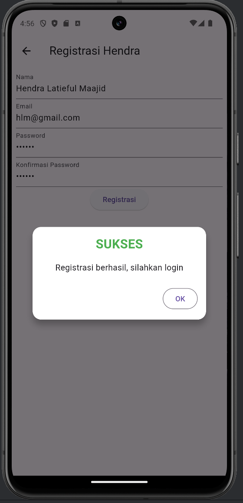


# B. Penjelasan Proses Login

## 1. Proses Login

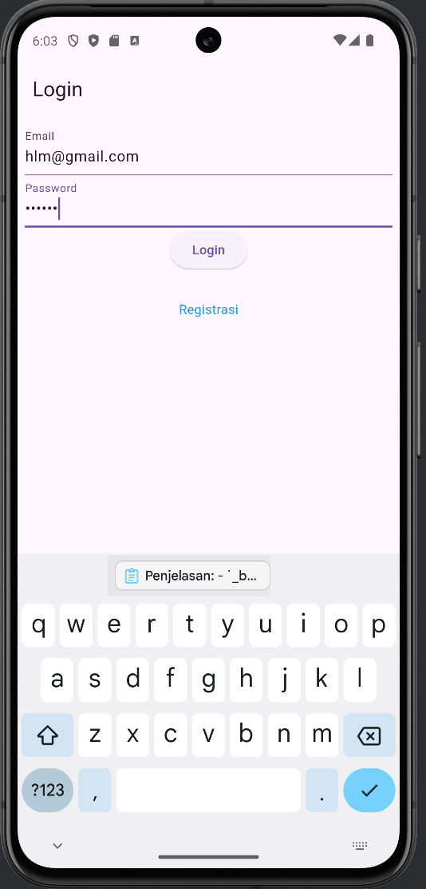
`_buttonLogin()` memvalidasi form sebelum memanggil `_submit()`.

```dart
Widget _buttonLogin() {
  return ElevatedButton(
    child: const Text("Login"),
    onPressed: () {
      var validate = _formKey.currentState!.validate();
      if (validate) {
        if (!_isLoading) _submit();
      }
    },
  );
}

void _submit() {
  _formKey.currentState!.save();
  setState(() {
    _isLoading = true;
  });
  LoginBloc.login(
    email: _emailTextboxController.text,
    password: _passwordTextboxController.text
  ).then((value) async {
    print("Login successful: $value");
    if (value.userID != null) {
      await UserInfo().setToken(value.token ?? "");
      await UserInfo().setUserID(value.userID!);
      Navigator.pushReplacement(context,
          MaterialPageRoute(builder: (context) => const ProdukPage()));
    } else {
      throw Exception("UserID is null");
    }
  }).catchError((error) {
    print("Login error: $error");
    showDialog(
      context: context,
      barrierDismissible: false,
      builder: (BuildContext context) => WarningDialog(
        description: "Login gagal: ${error.toString()}",
      )
    );
  }).whenComplete(() {
    setState(() {
      _isLoading = false;
    });
  });
}
```


## 2. Model Login

```dart
class Login {
  int? code;
  bool? status;
  String? token;
  int? userID;
  String? userEmail;

  Login({this.code, this.status, this.token, this.userID, this.userEmail});

  factory Login.fromJson(Map<String, dynamic> obj) {
    print(obj);  // Untuk debugging
    return Login(
        code: obj['code'],
        status: obj['status'],
        token: obj['data']['token'],
        userID: int.tryParse(obj['data']['user']['id'].toString()),
        userEmail: obj['data']['user']['email']
    );
  }
}
```


## 3. Login Bloc
Penjelasannya sama seperti registrasi hanya ini untuk yang login
```dart
import 'dart:convert';
import 'package:tokokita/helpers/api.dart';
import 'package:tokokita/helpers/api_url.dart';
import 'package:tokokita/model/login.dart';

class LoginBloc {
  static Future<Login> login({String? email, String? password}) async {
    String apiUrl = ApiUrl.login;
    var body = {"email": email, "password": password};
    var response = await Api().post(apiUrl, body);
    var jsonObj = json.decode(response.body);
    return Login.fromJson(jsonObj);
  }
}
```

## 4. Alur Proses Login

1. User mengisi form login di `LoginPage`.
2. Saat tombol login ditekan, validasi form dilakukan.
3. Jika valid, `_submit()` dipanggil, yang memanggil `LoginBloc.login()`.
4. `LoginBloc` mengirim data ke API menggunakan `Api().post()`.
5. API memproses data dan mengirim respons.
6. Respons dikonversi menjadi objek `Login`.
7. Jika login berhasil, token dan userID disimpan, dan user diarahkan ke `ProdukPage`.
8. Jika gagal, dialog peringatan ditampilkan.

## Penanganan Error
- Jika terjadi error, dialog peringatan akan ditampilkan.
<br>
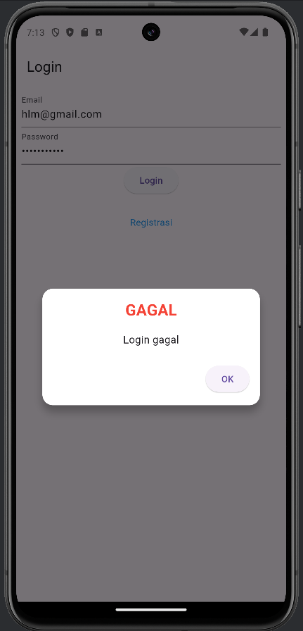
- jika tidak maka akan masuk ke beranda.
<br>
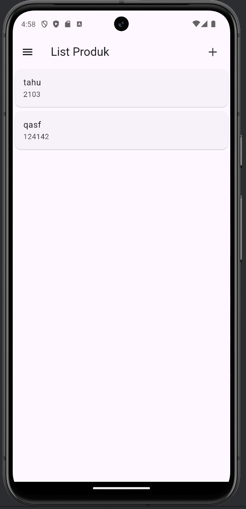

# C. Penjelasan Proses Tambah Data

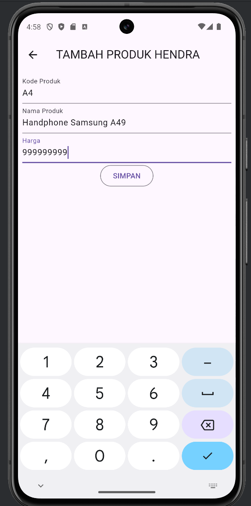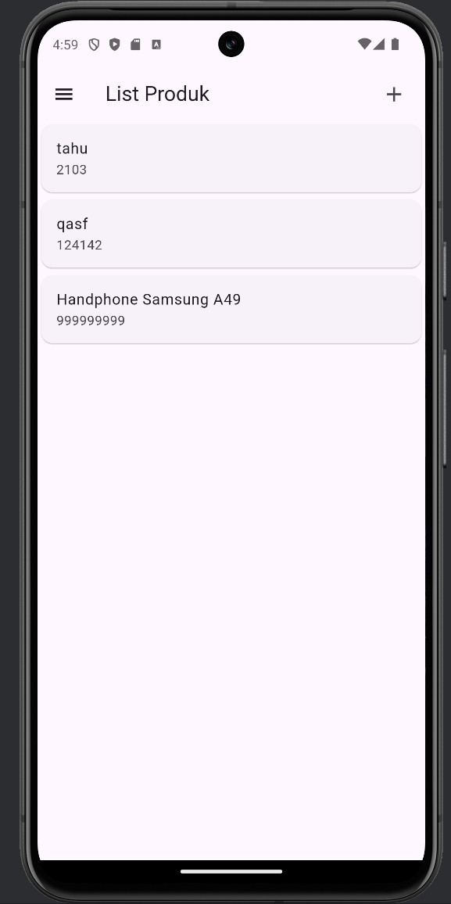

## 1. Model Produk
Model `Produk` merepresentasikan struktur data produk:
```dart
class Produk {
  String? id;
  String? kodeProduk;
  String? namaProduk;
  var hargaProduk;

  Produk({this.id, this.kodeProduk, this.namaProduk, this.hargaProduk});

  factory Produk.fromJson(Map<String, dynamic> obj) {
    return Produk(
        id: obj['id'],
        kodeProduk: obj['kode_produk'],
        namaProduk: obj['nama_produk'],
        hargaProduk: obj['harga']);
  }
}
```

## 2. ProdukBloc
Untuk menambahkan data produk kita hanya menggunakan fungsi yang addProduk() saja pada ProdukBloc
```dart
class ProdukBloc {
  static Future addProduk({Produk? produk}) async {
    String apiUrl = ApiUrl.createProduk;
    var body = {
      "kode_produk": produk!.kodeProduk,
      "nama_produk": produk.namaProduk,
      "harga": produk.hargaProduk.toString()
    };
    var response = await Api().post(apiUrl, body);
    var jsonObj = json.decode(response.body);
    return jsonObj['status'];
  }
}
```

addProduk() ini mengirim data produk ke API untuk ditambahkan ke database.

## 3. Proses Menambah Produk
1. Pengguna membuka form tambah produk melalui `ProdukForm` widget.
2. Pengguna mengisi data produk pada form yang terdiri dari:
    - Kode Produk (`_kodeProdukTextField`)
    - Nama Produk (`_namaProdukTextField`)
    - Harga Produk (`_hargaProdukTextField`)
3. Setelah mengisi form, pengguna menekan tombol "SIMPAN" (`_buttonSubmit`).
4. Sistem melakukan validasi form menggunakan `_formKey.currentState!.validate()`.
5. Jika form valid, sistem memanggil method `simpan()`.
6. Di dalam `simpan()`, objek `Produk` baru dibuat dengan data dari form.
7. Sistem memanggil `ProdukBloc.addProduk()` untuk mengirim data ke server.
8. Jika penambahan berhasil, pengguna diarahkan ke halaman daftar produk (`ProdukPage`).
9. Jika terjadi kesalahan, sistem menampilkan `WarningDialog` dengan pesan error.


# D. Penjelasan Proses Tampil Data

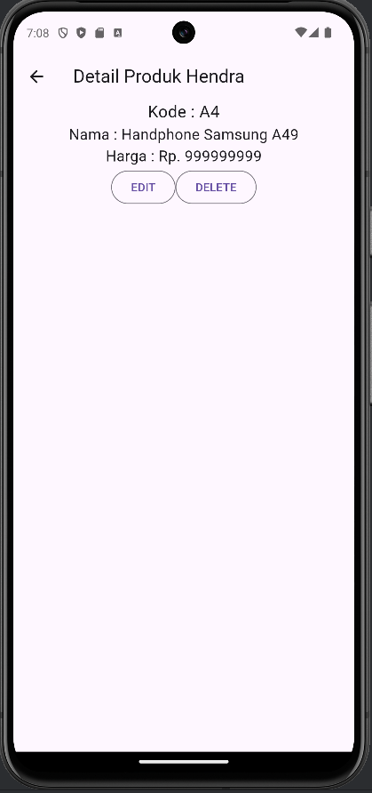

## 1. Model Produk
Model `Produk` merepresentasikan struktur data produk:
```dart
class Produk {
  String? id;
  String? kodeProduk;
  String? namaProduk;
  var hargaProduk;

  Produk({this.id, this.kodeProduk, this.namaProduk, this.hargaProduk});

  factory Produk.fromJson(Map<String, dynamic> obj) {
    return Produk(
        id: obj['id'],
        kodeProduk: obj['kode_produk'],
        namaProduk: obj['nama_produk'],
        hargaProduk: obj['harga']);
  }
}
```


## 2. ProdukBloc
Untuk menampilkan data produk kita hanya menggunakan fungsi yang getProduks() saja pada ProdukBloc
```dart
class ProdukBloc {
  static Future<List<Produk>> getProduks() async {
    String apiUrl = ApiUrl.listProduk;
    var response = await Api().get(apiUrl);
    var jsonObj = json.decode(response.body);
    List<dynamic> listProduk = (jsonObj as Map<String, dynamic>)['data'];
    List<Produk> produks = [];
    for (int i = 0; i < listProduk.length; i++) {
      produks.add(Produk.fromJson(listProduk[i]));
    }
    return produks;
  }
}
```

getProduks() ini mengambil daftar produk dari API, mengonversi respons JSON menjadi list objek Produk.
## 3. Proses Menampilkan Data
1. Data produk diambil menggunakan `ProdukBloc.getProduks()`.
2. Setiap item produk dalam daftar ditampilkan sebagai widget yang dapat diklik (`ListTile`).
3. Ketika item produk diklik, `ProdukDetail` widget dibuat dengan objek `Produk` yang sesuai.
4. `ProdukDetail` kemudian menampilkan informasi produk menggunakan data dari objek `Produk` yang diteruskan.


## 4. Fitur Edit dan Hapus

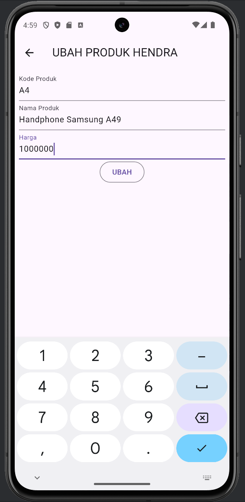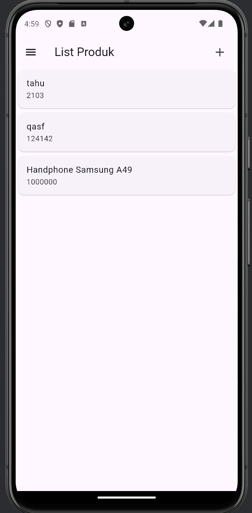

### Edit Produk
```dart
OutlinedButton(
  child: const Text("EDIT"),
  onPressed: () {
    Navigator.push(
      context,
      MaterialPageRoute(
        builder: (context) => ProdukForm(
          produk: widget.produk!,
        ),
      ),
    );
  },
),
```
```dart
static Future updateProduk({required Produk produk}) async {
    String apiUrl = ApiUrl.updateProduk(int.parse(produk.id!));
    print(apiUrl);
    var body = {
      "kode_produk": produk.kodeProduk,
      "nama_produk": produk.namaProduk,
      "harga": produk.hargaProduk.toString()
    };
    print("Body : $body");
    var response = await Api().put(apiUrl, jsonEncode(body));
    var jsonObj = json.decode(response.body);
    return jsonObj['status'];
  }
```

Penjelasan:
- Tombol "EDIT" membuka `ProdukForm` untuk mengedit produk yang ada.
- Data produk yang ada diteruskan ke `ProdukForm` sebagai parameter.
- `ProdukForm` kemudian menampilkan data produk yang ada untuk diedit.
- Setelah diedit, data produk dikirim kembali ke API untuk diperbarui.
- Jika berhasil, user diarahkan kembali ke `ProdukPage`.

### Hapus Produk

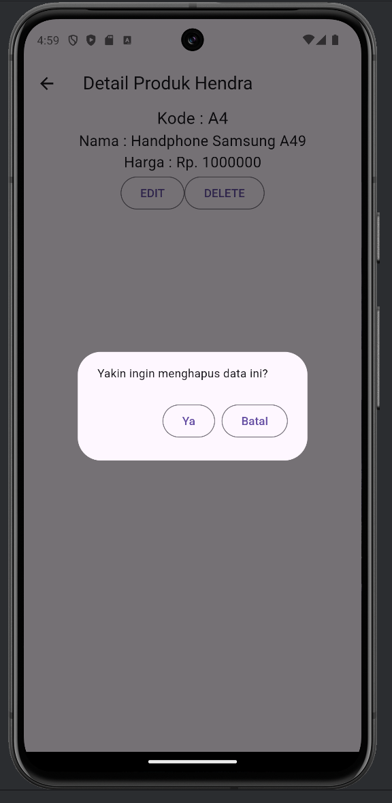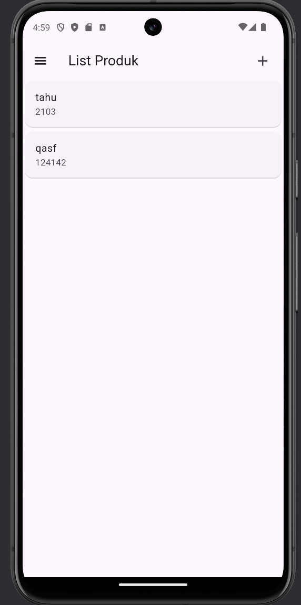

```dart
void confirmHapus() {AlertDialog alertDialog = AlertDialog(
  content: const Text("Yakin ingin menghapus data ini?"),
  actions: [
//tombol hapus
    OutlinedButton(
      child: const Text("Ya"),
      onPressed: () {
        ProdukBloc.deleteProduk(id: int.parse(widget.produk!.id!)).then(
                (value) => {
              Navigator.of(context).push(MaterialPageRoute(
                  builder: (context) => const ProdukPage()))
            }, onError: (error) {
          showDialog(
              context: context,
              builder: (BuildContext context) => const WarningDialog(
                description: "Hapus gagal, silahkan coba lagi",
              ));
        });
      },
    ),
//tombol batal
    OutlinedButton(
      child: const Text("Batal"),
      onPressed: () => Navigator.pop(context),
    )
  ],
);
showDialog(builder: (context) => alertDialog, context: context);
}
```
```dart
static Future<bool> deleteProduk({int? id}) async {
    String apiUrl = ApiUrl.deleteProduk(id!);
    var response = await Api().delete(apiUrl);
    var jsonObj = json.decode(response.body);
    return (jsonObj as Map<String, dynamic>)['data'];
}
```

Penjelasan:
- Tombol "DELETE" memunculkan dialog konfirmasi.
- Jika dikonfirmasi, `ProdukBloc.deleteProduk()` dipanggil untuk menghapus produk.
- Setelah berhasil dihapus, navigasi kembali ke `ProdukPage`.

# E. Penjelasan Logout


```dart
 drawer: Drawer(
        child: ListView(
          children: [
            ListTile(title: const Text('Logout'),
              trailing: const Icon(Icons.logout),
              onTap: () async {
                await LogoutBloc.logout().then((value) => {
                  Navigator.of(context).pushAndRemoveUntil(
                      MaterialPageRoute(builder: (context) => LoginPage()),
                          (route) => false)
                });
              },
            )
          ],
        ),
      ),
```

## Logout Bloc

Bloc ini berfungsi untuk melakukan proses logout
```dart
class LogoutBloc {
  static Future logout() async {
    await UserInfo().logout();
  }
}
```

## Proses Logout

1. User membuka sidemenu aplikasi.
2. User menekan tombol "Logout" yang ada di dalam sidemenu.
3. Saat tombol logout ditekan, `onTap` callback dijalankan.
4. `LogoutBloc.logout()` dipanggil secara asynchronous.
5. `LogoutBloc` memanggil `UserInfo().logout()` untuk melakukan proses logout.
6. `UserInfo().logout()` kemungkinan menghapus token, data sesi, atau melakukan operasi pembersihan lainnya.
7. Setelah proses logout selesai, aplikasi melakukan navigasi ke `LoginPage`.


